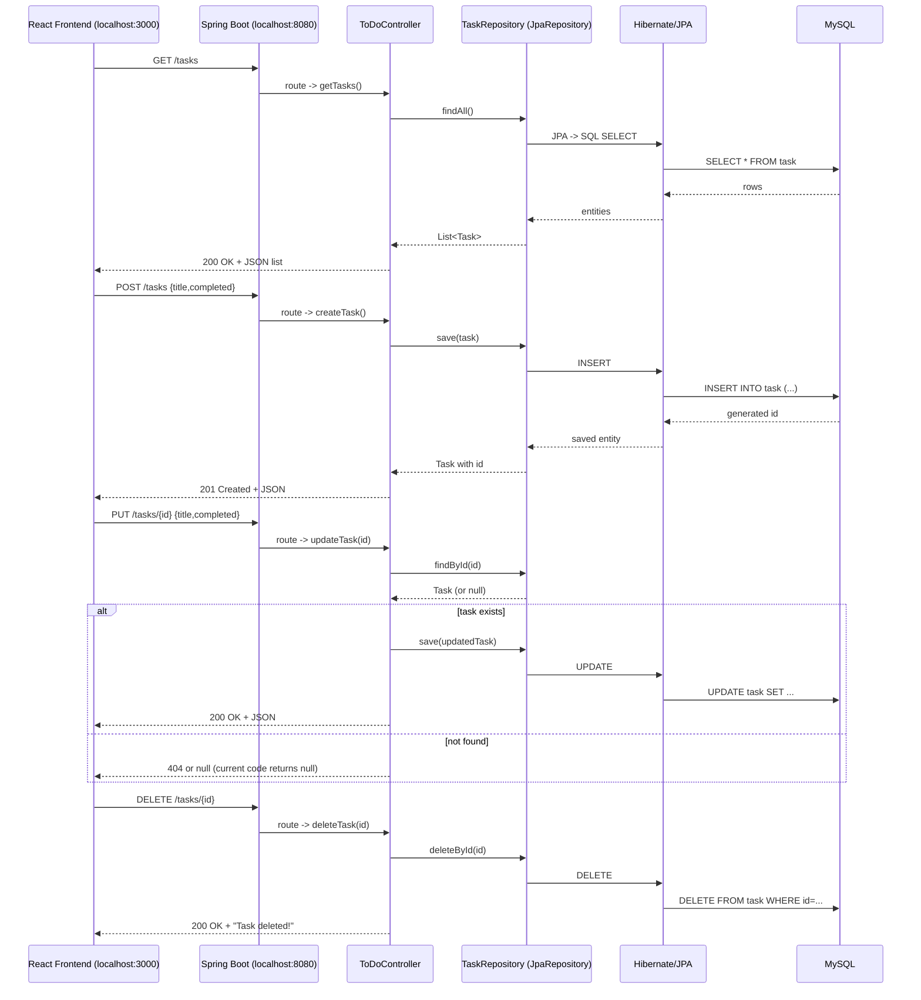
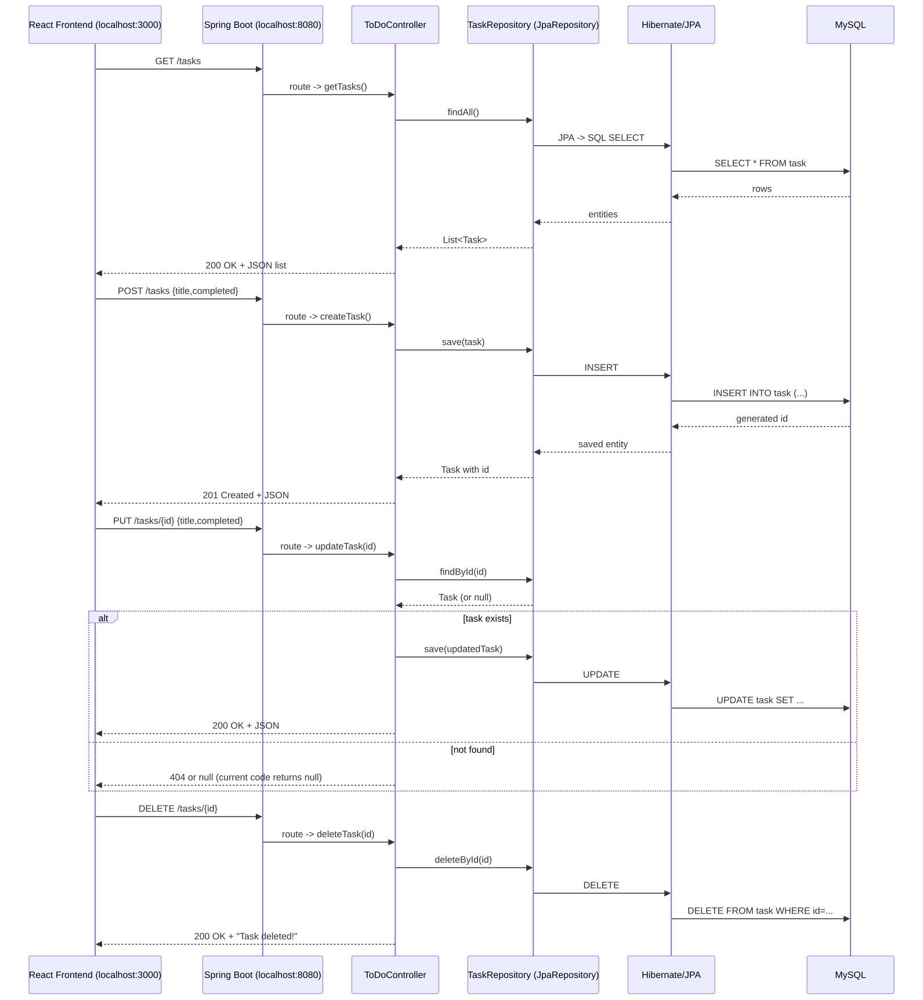

# Sequence Diagram — ToDo App

This file contains a visual sequence diagram for the ToDo app (backend + frontend). Copy the Mermaid block into any Markdown viewer that supports Mermaid or export it to an image using the commands below.

## Mermaid diagram



## Export to image (SVG/PNG)

You can export this Mermaid diagram to an image using `@mermaid-js/mermaid-cli`.

Install and run (global install option):

```bash
npm install -g @mermaid-js/mermaid-cli
mmdc -i demo/docs/sequence.mmd -o demo/docs/sequence.svg
```

Or using `npx` without global install:

```bash
npx -p @mermaid-js/mermaid-cli mmdc -i demo/docs/sequence.mmd -o demo/docs/sequence.svg
```

Embed the exported SVG in Markdown (works on GitHub):

```markdown

```

If you want, I can attempt to generate and add the exported SVG here — say "generate image" and I'll try it (requires Node/npm available on your machine).
